CS Ticketing — User Manual
==========================

Akses & layout
--------------
- Akses lokal: `http://localhost/cs_ticketing/`.
- Layout: sidebar kiri, top navbar (notifikasi + profil), konten utama di kanan.
- Role: **Admin** (akses penuh), **Supervisor** (operasional tiket & pelanggan, kategori read-only), **Agent** (operasional tiket milik sendiri, pelanggan read-only).

Login, logout, lupa password
----------------------------
1) Login dengan `username` + `password`.  
2) Logout lewat menu profil.  
3) Jika akun ditandai `must_change_password`, otomatis diarahkan ke halaman **Ganti Password** setelah login.  
4) Lupa password: klik **Lupa password**, isi username + kontak. Permintaan dicatat; admin memberi password sementara via User Management. User wajib ganti password saat login pertama setelah reset.

Dashboard
---------
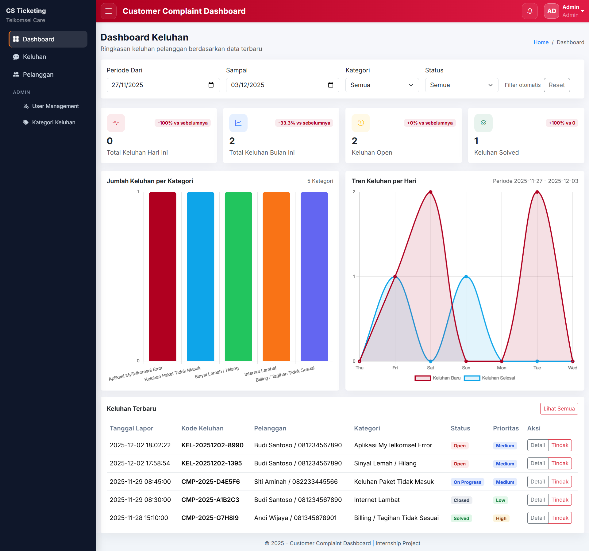
- Filter periode, kategori, status (otomatis terapkan).  
- Kartu stat (hari ini/bulan berjalan/open/solved) + delta vs periode sebelumnya.  
- Bar per kategori dan tren harian (baru vs selesai).  
- Tabel keluhan terbaru + tombol **Lihat semua**.

Keluhan
-------
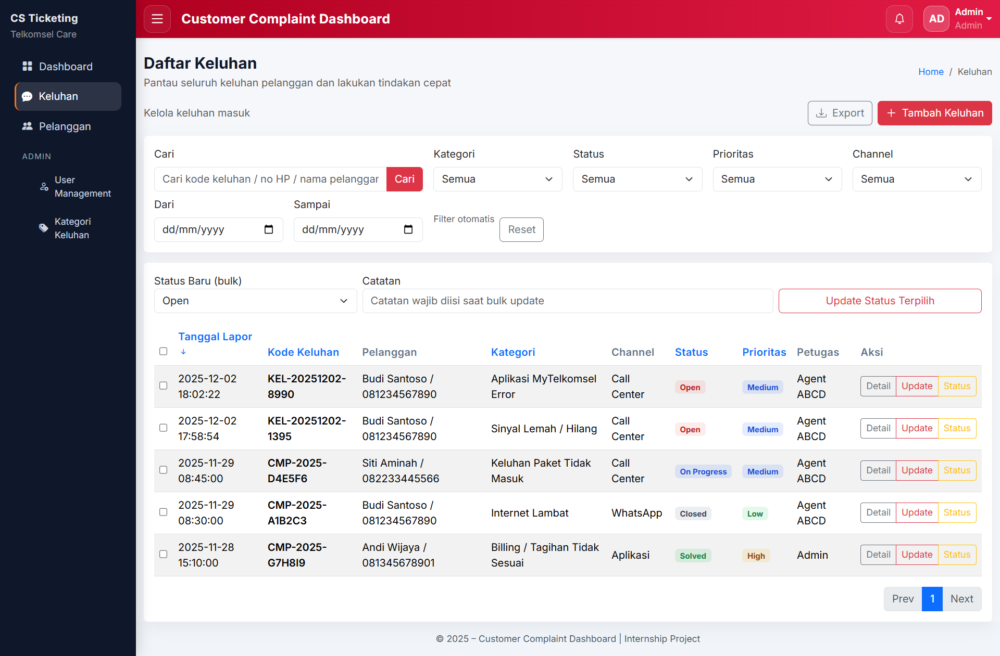
- List: filter kategori/status/prioritas/channel/range tanggal/pelanggan, cari kode/no HP/nama, sort per kolom, pagination.  
- Aksi cepat: quick status (modal) dan bulk update status dengan catatan wajib. Agent hanya boleh mengubah tiket miliknya.  
- Export CSV/XLSX mengikuti filter aktif.  
- Soft delete: admin/supervisor bisa klik **Hapus**; data pindah ke arsip dan hilang dari list.  
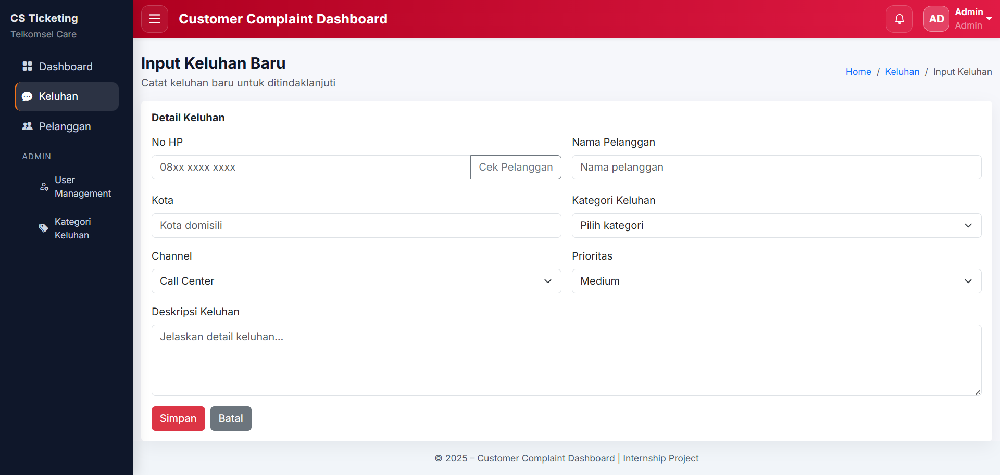
- Tambah: isi pelanggan (cek No HP), kategori, channel, prioritas, deskripsi; tiket dibuat dan notifikasi terkirim ke admin/supervisor.  
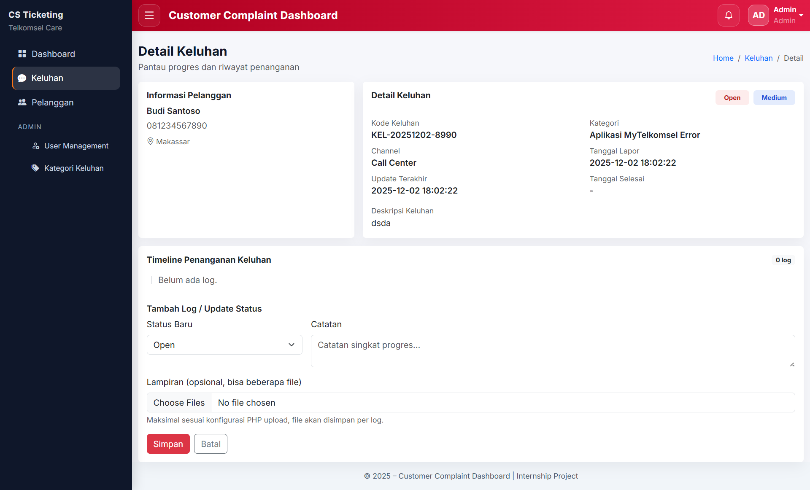
- Detail: info pelanggan, status/prioritas/deskripsi, timeline log dengan lampiran (disimpan di `public/uploads/keluhan/{id}/log_{log_id}/`), form tambah log + upload multiple.  
- Edit: ubah kategori/channel/prioritas/deskripsi; agent hanya boleh untuk tiket miliknya.

Pelanggan
---------
- 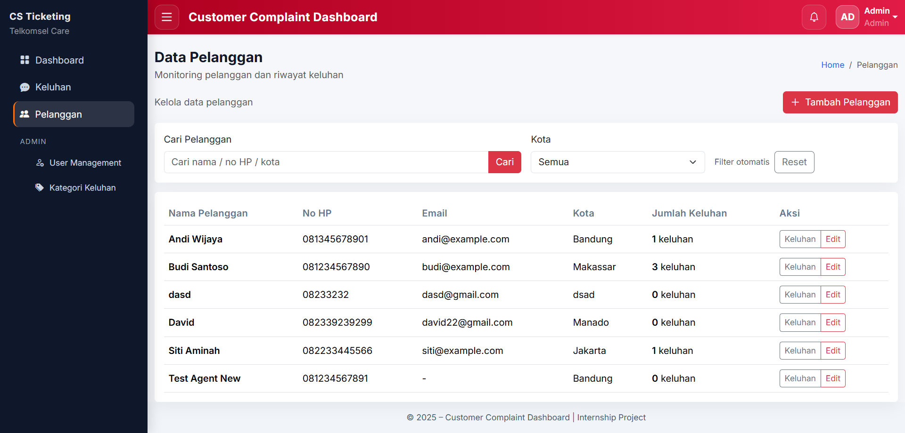
- List + filter/cari; tampil jumlah keluhan.  
- Admin/Supervisor: tambah/edit dan soft delete.  
- Agent: baca saja.

Admin: User Management
----------------------
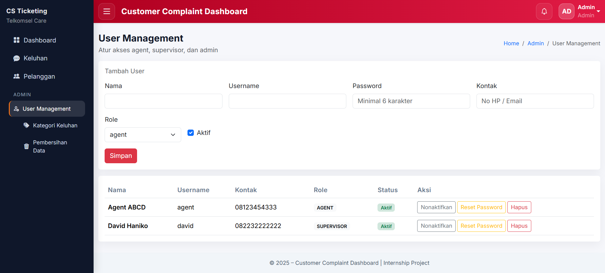
- Tambah user: nama, kontak, username, password, role, aktif/nonaktif.  
- Toggle aktif/nonaktif, reset password per user (password sementara tampil sekali).  
- Soft delete user (tersembunyi dari login & daftar); permanen dihapus via Pembersihan Data.  
- Kartu Permintaan Reset Password: daftar pending dari form lupa password, reset langsung dari sini.

Admin: Kategori Keluhan
-----------------------
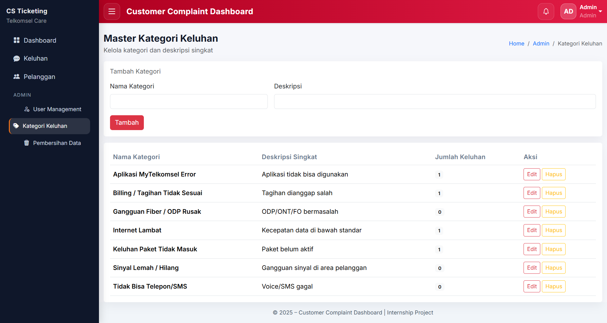
- Admin: tambah/edit/soft delete kategori.  
- Supervisor: read-only.  
- Keluhan memakai kategori yang aktif saja.

Pembersihan Data (Cleanup)
--------------------------
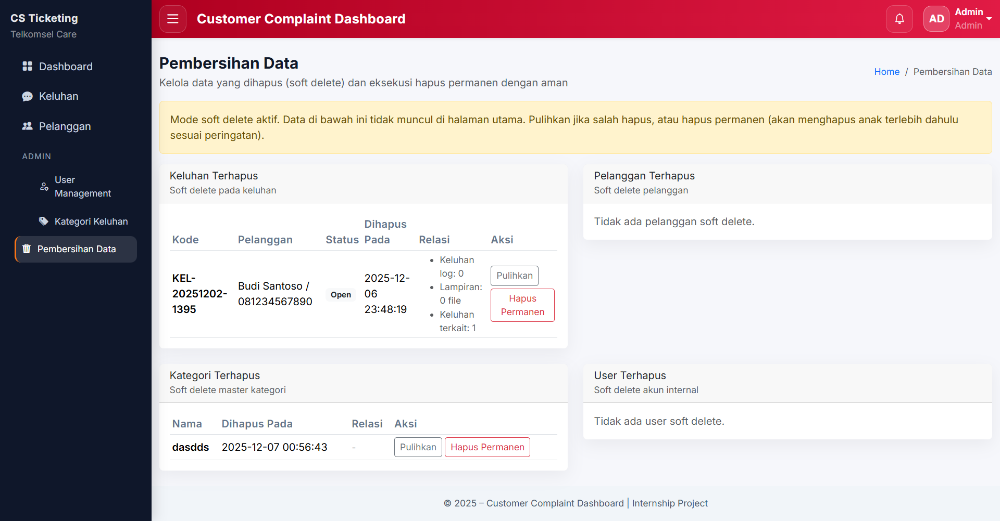
- Menu admin: **Pembersihan Data** menampilkan semua data soft delete (keluhan, pelanggan, kategori, user).  
- Aksi: **Pulihkan** atau **Hapus permanen**. Modal hapus menampilkan peringatan relasi yang ikut terhapus (log keluhan, lampiran, keluhan terkait pelanggan/kategori, notifikasi/reset password milik user).  
- Hapus permanen memulai dari data paling anak, termasuk menghapus folder upload keluhan.

Notifikasi
----------
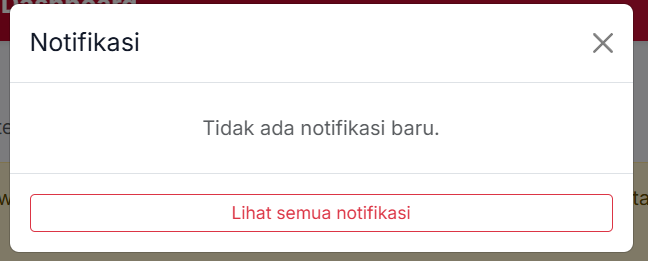
- Ikon lonceng menampilkan modal notifikasi belum dibaca dan menandainya read.
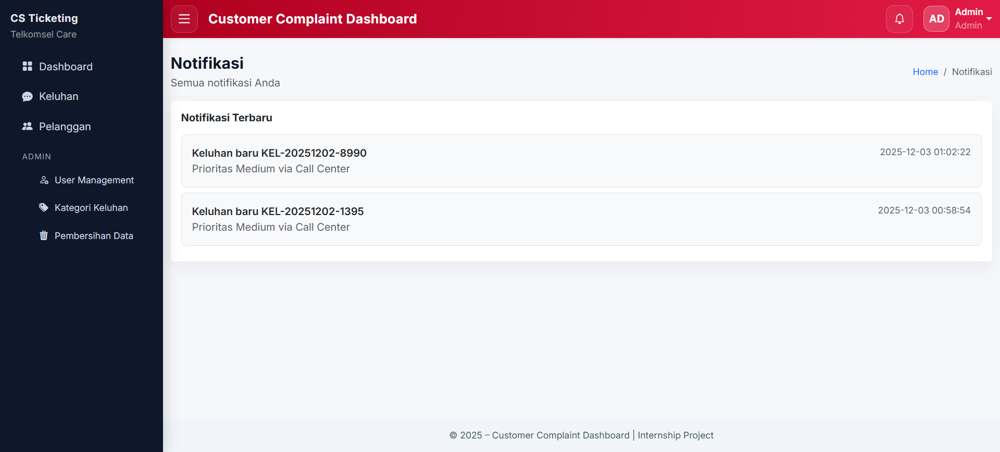
- Halaman semua notifikasi: paginasi load-more.  
- Notifikasi dibuat saat tiket baru (ke admin/supervisor) dan perubahan status oleh user lain (ke pemilik tiket).

Profil & ganti password
-----------------------
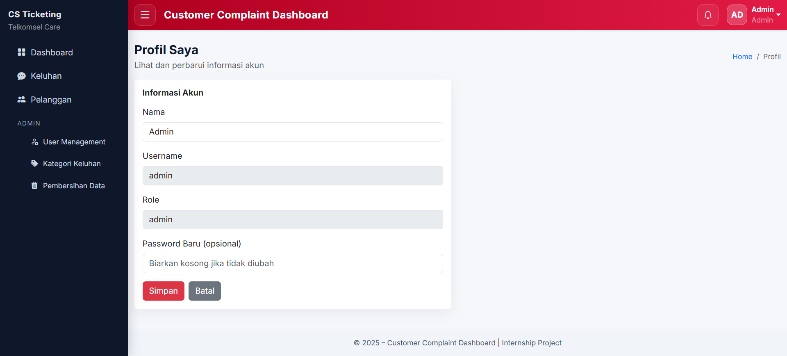
- Ubah nama dan password sendiri dari menu profil.  
- User dengan password sementara wajib ganti sebelum akses halaman lain.

Hak akses ringkas
-----------------
- Admin: semua fitur + cleanup + kelola user/kategori.  
- Supervisor: dashboard, keluhan penuh, pelanggan add/edit, kategori read-only, tidak kelola user.  
- Agent: dashboard read, keluhan (tambah; edit/status hanya tiket miliknya), pelanggan read-only, tidak ada menu admin.

Ekspor & impor
--------------
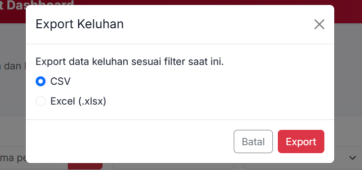
- Keluhan list: ekspor CSV/XLSX. Tidak ada impor massal.

Troubleshooting singkat
-----------------------
- Gagal simpan keluhan: pastikan field wajib terisi dan pilihan valid.  
- Lampiran hilang: cek izin tulis folder `public/uploads/keluhan`.  
- Tidak bisa hapus permanen: pastikan data sudah soft delete terlebih dahulu, lalu gunakan menu Pembersihan Data.

Penempatan file penting
-----------------------
- Front controller & routing: `public/index.php`  
- View: `app/views/...` (termasuk `cleanup/index.php` untuk Pembersihan Data)  
- Asset JS/CSS: `public/assets/`  
- Upload lampiran: `public/uploads/keluhan/{id}/log_{log_id}/`
